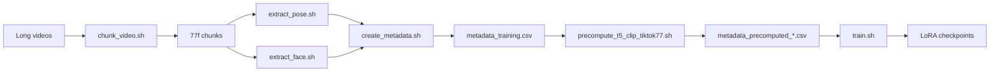

# Wan2.2-Animate-14B — data prep & training workflow

This guide describes the **end-to-end pipeline** used in this repo to prepare TikTok-style videos and train a **Wan2.2-Animate-14B LoRA** with [DiffSynth-Studio](https://github.com/modelscope/DiffSynth-Studio).

Upstream DiffSynth docs: [Wan model (EN)](https://diffsynth-studio-doc.readthedocs.io/en/latest/Model_Details/Wan.html) · [中文版](https://diffsynth-studio-doc.readthedocs.io/zh-cn/latest/Model_Details/Wan.html)

---

## Layout

Scripts in this folder assume a **project root** (called `PROJECT_ROOT` below) that contains:

```text
PROJECT_ROOT/
├── DiffSynth-Studio/              # this repo
│   └── preprocess_scripts/        # shell wrappers (this folder)
├── preprocessing_code/            # Python: chunk metadata, face, pose
├── env_dir/animate/               # conda env for training & precompute
├── Wan2.2-Animate-14B/            # base model + process_checkpoint/
└── wan_animate_data/tiktok-videos_77/
    ├── videos/                    # raw long videos (input to chunking)
    ├── chunks_77f_30fps/          # 77-frame @ 30 fps clips
    ├── chunks_77f_30fps_pose/     # pose conditioning videos
    ├── chunks_77f_30fps_face/     # face conditioning videos
    ├── metadata_training.csv
    ├── metadata_precomputed_clip_first.csv   # optional
    ├── metadata_precomputed_clip_random.csv  # optional
    └── precomputed/
        ├── t5/                    # shared T5 embedding(s)
        └── clip/                  # per-row CLIP embeddings
```

Several `.sh` files still use **absolute paths** from a specific machine. Before running, edit paths in the script or override the documented environment variables.

---

## Pipeline overview



| Step | Script | Output |
|------|--------|--------|
| 1 | `chunk_video.sh` | Fixed-length clip MP4s |
| 2 | `extract_pose.sh` | Pose videos per chunk |
| 3 | `extract_face.sh` | Face videos per chunk |
| 4 | `create_metadata.sh` | `metadata_training.csv` |
| 5 | `precompute_t5_clip_tiktok77.sh` | T5/CLIP `.pt` + precomputed metadata CSV |
| 6 | `train.sh` | LoRA `step-*.safetensors` |

Run steps **in order**. Step 4 requires pose and face; step 5 requires metadata; step 6 requires the precomputed metadata CSV.

---

## 0. Prerequisites

- **GPU**: multi-GPU recommended for precompute and training (4× ~98 GB tested).
- **Conda env**: `env_dir/animate` (or set `WAN_TRAIN_CONDA_ENV`).
- **Weights**: `Wan2.2-Animate-14B/` including `process_checkpoint/` for face/pose extractors.
- **Frame count**: Wan Animate expects `num_frames % 4 == 1` (default **77**).

---

## 1. Chunk long videos — `chunk_video.sh`

Splits each file under `videos/` into consecutive clips with exactly **77 frames at 30 fps** (~2.57 s per clip). Short tails are freeze-padded so every output clip has 77 frames.

**Python**: `preprocessing_code/../wan_animate_data/tiktok-videos/extract_5s_chunks.py` (invoked via `conda run`).

**Typical paths** (edit in the script):

| Variable | Example |
|----------|---------|
| Input | `wan_animate_data/tiktok-videos_77/videos` |
| Output | `wan_animate_data/tiktok-videos_77/chunks_77f_30fps` |

**Run** (after editing paths):

```bash
bash DiffSynth-Studio/preprocess_scripts/chunk_video.sh
```

**Output naming**: `{source_stem}_chunk0000.mp4`, `_chunk0001.mp4`, …

---

## 2. Extract pose videos — `extract_pose.sh`

Runs ViTPose (via Wan process checkpoints) on each chunk and writes black-background pose MP4s.

**Python**: `preprocessing_code/extract_pose_videos.py`

| Flag | Meaning |
|------|---------|
| `--input-dir` | `chunks_77f_30fps` |
| `--output-dir` | `chunks_77f_30fps_pose` |
| `--ckpt-dir` | `Wan2.2-Animate-14B/process_checkpoint` |
| `--skip-existing` | Resume safely |

**Output naming**: `NNNNN_{chunk_stem}_pose.mp4` (e.g. `00042_foo_chunk0003_pose.mp4`).

```bash
bash DiffSynth-Studio/preprocess_scripts/extract_pose.sh
```

---

## 3. Extract face videos — `extract_face.sh`

Extracts face crops / face conditioning videos aligned to each chunk.

**Python**: `preprocessing_code/extract_face_videos.py`

**Output naming**: `NNNNN_{chunk_stem}_face.mp4`.

```bash
bash DiffSynth-Studio/preprocess_scripts/extract_face.sh
```

---

## 4. Create training metadata — `create_metadata.sh`

Joins chunk + pose + face paths into one CSV for training/precompute. Only rows where all three files exist and pass validation are kept.

**Python**: `preprocessing_code/build_metadata_tiktok77.py`

```bash
bash DiffSynth-Studio/preprocess_scripts/create_metadata.sh
```

### Output CSV: `metadata_training.csv`

**Columns**:

| Column | Description |
|--------|-------------|
| `video` | Absolute path to the chunk MP4 |
| `prompt` | Text prompt (same string for all rows in default setup) |
| `animate_pose_video` | Pose MP4 path |
| `animate_face_video` | Face MP4 path |

**Example rows** (truncated paths for readability):

```csv
video,prompt,animate_pose_video,animate_face_video
/path/to/chunks_77f_30fps/alice_chunk0000.mp4,视频中的人在做动作,/path/to/chunks_77f_30fps_pose/00000_alice_chunk0000_pose.mp4,/path/to/chunks_77f_30fps_face/00000_alice_chunk0000_face.mp4
/path/to/chunks_77f_30fps/alice_chunk0001.mp4,视频中的人在做动作,/path/to/chunks_77f_30fps_pose/00001_alice_chunk0001_pose.mp4,/path/to/chunks_77f_30fps_face/00001_alice_chunk0001_face.mp4
```

**Stem matching**: pose/face files must match the chunk stem (`{video_stem}`) with prefix index `NNNNN_` and suffix `_pose` / `_face`.

Optional flags on the Python tool: `--relative-to-repo`, `--prompt "your text"`, `--io-workers 48`.

---

## 5. Precompute T5 + CLIP — `precompute_t5_clip_tiktok77.sh`

Encodes text with **T5** and one frame per row with **CLIP**, then writes a new metadata CSV with paths to `.pt` tensors. Training can skip loading T5/CLIP weights (`USE_PRECOMPUTED=1`).

**Underlying script**: `examples/wanvideo/model_training/lora/precompute-t5-clip.sh`

### Shared T5 prompt (default)

When `WAN_PRECOMPUTE_SHARED_T5=1` (default in this wrapper):

- T5 runs **once** on `WAN_PRECOMPUTE_SHARED_T5_PROMPT` (default: `视频中的人在做动作`).
- Every CSV row points to the same file, e.g. `precomputed/t5/shared_single_prompt.pt`.
- **CLIP** is still computed **per row** (per video).

### CLIP frame mode

| Command | CLIP source | Output metadata |
|---------|-------------|-----------------|
| `./precompute_t5_clip_tiktok77.sh first` | First frame of each chunk | `metadata_precomputed_clip_first.csv` |
| `./precompute_t5_clip_tiktok77.sh random [seed]` | Random frame (deterministic per row) | `metadata_precomputed_clip_random.csv` |

```bash
cd DiffSynth-Studio/preprocess_scripts
./precompute_t5_clip_tiktok77.sh first
# or
./precompute_t5_clip_tiktok77.sh random 42
```

**Useful env vars**:

| Variable | Default | Purpose |
|----------|---------|---------|
| `WAN_ANIMATE_DATA_ROOT` | `…/tiktok-videos_77` | Dataset root |
| `WAN_ANIMATE_METADATA_IN` | `metadata_training.csv` | Input CSV |
| `WAN_PRECOMPUTE_SHARED_T5` | `1` | Single shared T5 file |
| `WAN_PRECOMPUTE_SHARED_T5_PROMPT` | `视频中的人在做动作` | T5 input text |
| `WAN_ANIMATE_HEIGHT` / `WAN_ANIMATE_WIDTH` | `720` / `1280` | CLIP resize budget |
| `WAN_PRECOMPUTE_NUM_WORKERS` | `4` | GPU worker processes |
| `WAN_CLIP_BATCH_SIZE` | `16` | CLIP batch size |

**Alternative**: `extract_embedding.sh` is a fully configured example (random CLIP, area-budget 720×1280, multi-GPU).

### Output CSV: `metadata_precomputed_clip_*.csv`

Adds two columns to the training metadata:

| Column | Description |
|--------|-------------|
| `t5_context` | Path to T5 embedding `.pt` |
| `clip_feature` | Path to CLIP embedding `.pt` |

**Example** (shared T5 + per-row CLIP):

```csv
video,prompt,animate_pose_video,animate_face_video,t5_context,clip_feature
/path/to/chunks/foo_chunk0000.mp4,视频中的人在做动作,/path/to/pose/00000_foo_chunk0000_pose.mp4,/path/to/face/00000_foo_chunk0000_face.mp4,/path/to/precomputed/t5/shared_single_prompt.pt,/path/to/precomputed/clip/000000.pt
```

Precomputed tensors are stored under `precomputed/t5/` and `precomputed/clip/` (or `precomputed_random/clip/` when using random mode).

---

## 6. Train LoRA — `train.sh`

Launches **4-GPU DDP** LoRA training via `examples/wanvideo/model_training/lora/Wan2.2-Animate-14B-meanflow.sh`.

```bash
bash DiffSynth-Studio/preprocess_scripts/train.sh
```

### Important settings (in `train.sh`)

| Setting | Default | Notes |
|---------|---------|--------|
| `USE_PRECOMPUTED` | `1` | Loads `t5_context` + `clip_feature` from disk |
| `WAN_ANIMATE_METADATA` | `metadata_precomputed_clip_random.csv` | Point to `…_first.csv` if you used `first` mode |
| `WAN_ANIMATE_NUM_FRAMES` | `77` | Must satisfy `N % 4 == 1` |
| `WAN_ANIMATE_HEIGHT` × `WIDTH` | `480` × `832` | Training resolution budget (area-preserving). Use `720`×`1280` if VRAM allows |
| `WAN_ANIMATE_OUTPUT_PATH` | `checkpoint_random_frame/` | LoRA output directory |
| `WAN_SAVE_STEPS` | `1000` | Saves `step-1000.safetensors`, `step-2000.safetensors`, … |
| `WAN_NCCL_MODE` | `local` | Single-node multi-GPU NCCL (GCP: avoid broken gIB plugin) |
| `WAN_TRAIN_NUM_GPUS` | `4` | DDP world size |

**Checkpoints**: only **step** checkpoints are written when `WAN_SAVE_STEPS` is set (no per-epoch `epoch-*.safetensors`). A final save runs at training end if the last step is not a multiple of 1000.

**VRAM**: 77 frames at 720×1280 with VAE often needs ~94 GB/GPU even with precomputed T5/CLIP. If OOM, train at `480×832` or precompute video latents (`USE_VIDEO_LATENTS=1` in meanflow — not covered here).

**Debug**:

```bash
WAN_CUDA_DEBUG=1 bash DiffSynth-Studio/preprocess_scripts/train.sh
```

---

## Quick reference — script → Python entrypoint

| Shell script | Python / target |
|--------------|-----------------|
| `chunk_video.sh` | `wan_animate_data/tiktok-videos/extract_5s_chunks.py` |
| `extract_pose.sh` | `preprocessing_code/extract_pose_videos.py` |
| `extract_face.sh` | `preprocessing_code/extract_face_videos.py` |
| `create_metadata.sh` | `preprocessing_code/build_metadata_tiktok77.py` |
| `precompute_t5_clip_tiktok77.sh` | `examples/.../precompute-t5-clip.sh` → `precompute_t5_clip_embeddings.py` |
| `train.sh` | `examples/.../Wan2.2-Animate-14B-meanflow.sh` → `train.py` |

---

## Troubleshooting

| Issue | What to check |
|-------|----------------|
| `create_metadata` skips many rows | Pose/face missing or wrong `NNNNN_{stem}_pose.mp4` naming |
| Precompute OOM | Lower `WAN_CLIP_BATCH_SIZE` or fewer `WAN_PRECOMPUTE_NUM_WORKERS` |
| Multi-GPU exit at DDP init | `WAN_NCCL_MODE=local` on GCP; avoid `gib_only` if NET plugin fails |
| Training shape error on frames | Use `77` (or any `N` with `N % 4 == 1`), not `16` |
| Unused-parameter DDP error | `WAN_FIND_UNUSED_PARAMETERS=1` in meanflow (off by default for speed) |

---

## Related files outside this folder

- **Training implementation**: `examples/wanvideo/model_training/train.py`, `diffsynth/diffusion/runner.py` (`save_steps` → `ModelLogger.on_step_end`)
- **Project-level launcher** (duplicate of `preprocess_scripts/train.sh` with different defaults): `/train.sh` at repo parent if present
